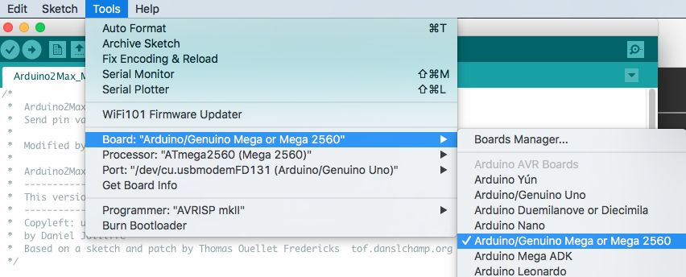

# arduino2max
A fork of a fork of arduino2max, aiming at using the Arduino Mega 2560 in Max by Cycling '74. 

There are two patches included in the project.

## ArduinoMega2560-Simple-Communication ##

This patch is based on [a minimal example](http://www.underwater.ca/blog/arduino-to-max-msp/) of a connection to an Arduino Mega 2560 using the serial object in Max.

## ArduinoMega2560-SoundMaker ##

This patch based on the [fork by joesanford](https://github.com/joesanford/arduino2max), requires a particular Arduino sketch (both the Max patch and Arduino sketch are available in the subfolders here). To make it work: 

1. Open "Arduino2Max_Mega.ino" in the Arduino platform
2. Remember to choose "Arduino/Genuino Mega or Mega 2560" in the Arduino program before uploading the code (see below)
3. Open the "ArduinoMega2560-SoundMaker" patch in Max
4. Select the right port for the Arduino board in the drop-down menu
5. Start fetching data from the device

The patch also contains a small sound engine, so that it is possible to control an additive synthesis with the sensors. This is not a very advanced mapping, but it works for testing the sensors.

