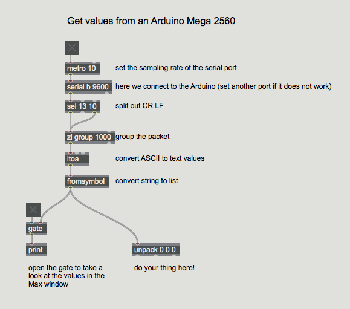
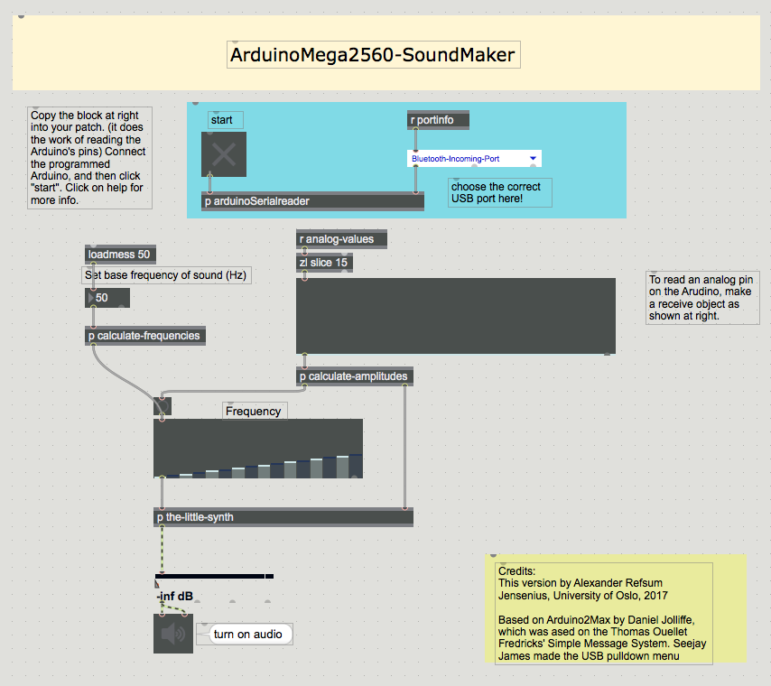

# arduino2max
A fork of a fork of arduino2max, aiming at using the Arduino Mega 2560 in Max by Cycling '74. 

There are two patches included in the project.

## ArduinoMega2560-Simple-Communication ##

This patch is based on [a minimal example](http://www.underwater.ca/blog/arduino-to-max-msp/) of a connection to an Arduino Mega 2560 using the serial object in Max.

## ArduinoMega2560-SoundMaker ##

This patch based on the [fork by joesanford](https://github.com/joesanford/arduino2max), requires a particular Arduino sketch (both the Max patch and Arduino sketch are available in the subfolders here). To make it work: 

1. 

I also added a small sound engine, so that it is possible to control an additive synthesis with the sensors. The steps to make this work is explained below.

The mapping from sensor data starts by normalizing the data from the 15 analog sensors to a 0.-1. range (by dividing by 255). Since I want to control the amplitudes of each of the partials in the additive synthesis, it makes sense to slightly reduce all of the amplitudes by multiplying each element with a decreasing figure, as shown here:

Then the amplitudes are interleaved with the frequency values and sent to an ioscbank~ object to do the additive synthesis.

Not a very advanced mapping, but it works for testing the sensors and the concept.

